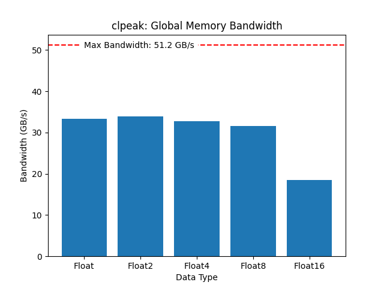
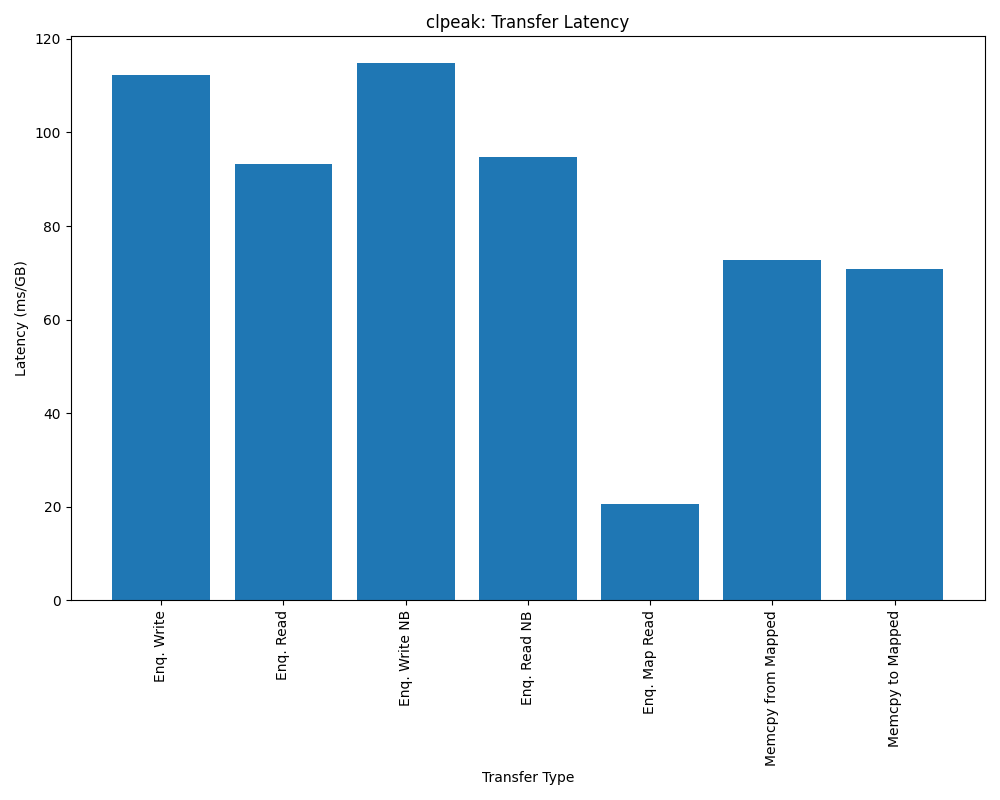
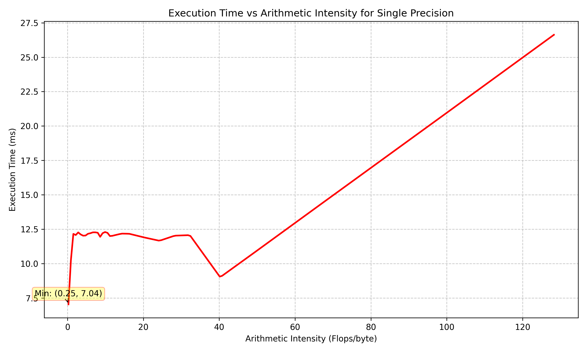
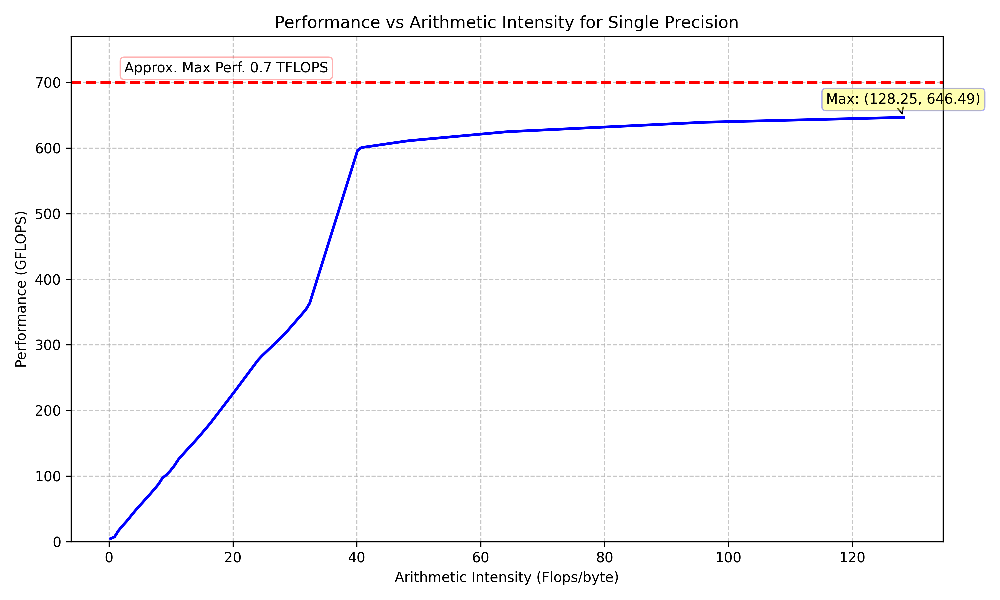
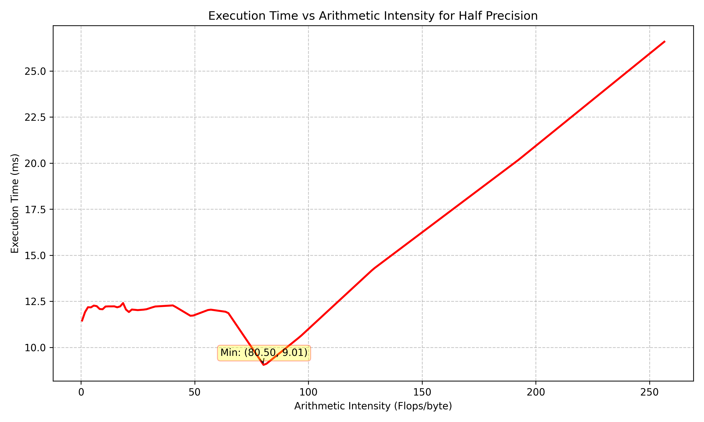
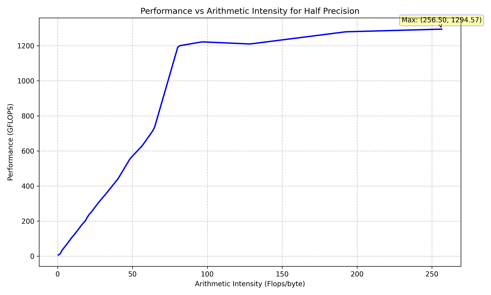
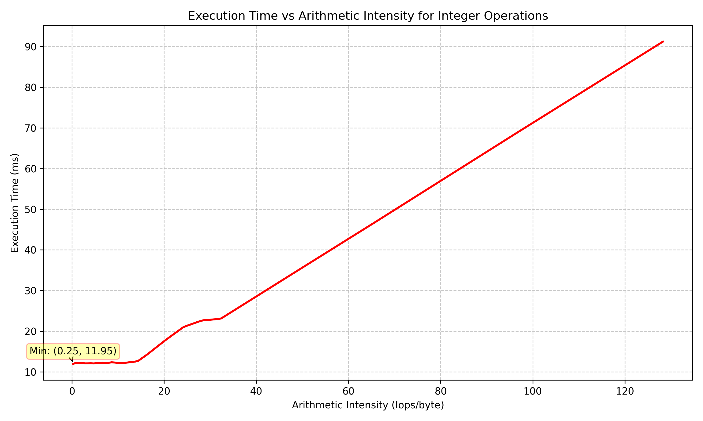
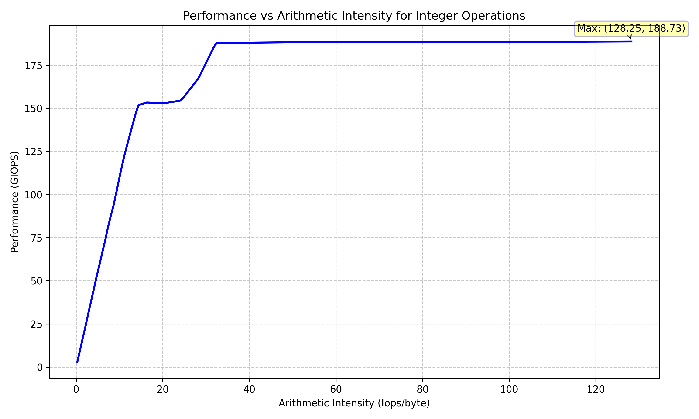

# OpenCL Benchmark

### Structure
There are 2 subdirectories:
- `clpeak_res`
- `mixbench_res`
- `candidate_graphs`

The first two correspond to the `clpeak` and `mixbench` benchmarks respectively. The last one contains the finalised graphs to be used in the paper.

Here are the graphs:
<table>
  <tr>
    <td></td>
    <td></td>
  </tr>
  <tr>
    <td></td>
    <td></td>
  </tr>
  <tr>
    <td></td>
    <td></td>
  </tr>
  <tr>
    <td></td>
    <td></td>
  </tr>
</table>

These were run on the Google Pixel Fold.

### Benchmark References

#### clpeak
> https://github.com/krrishnarraj/clpeak

#### mixbench
> https://github.com/ekondis/mixbench

> [Paper](https://doi.org/10.1016/j.jpdc.2017.04.002)
